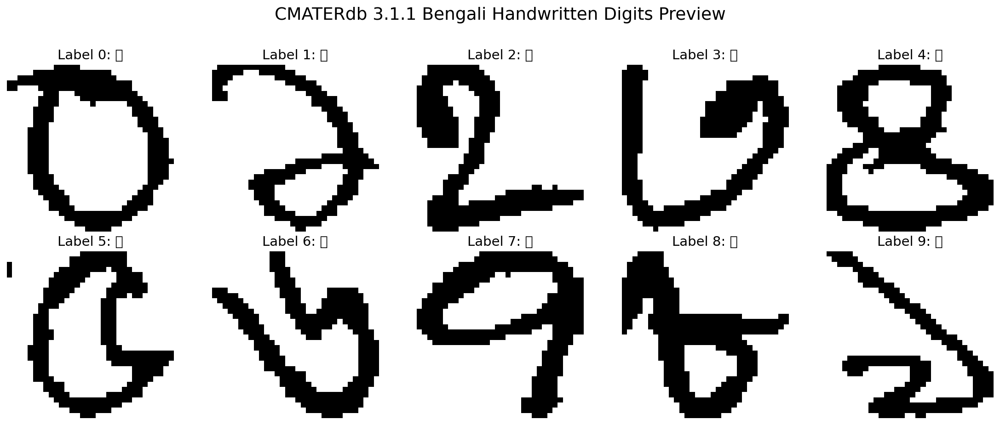

# Handwritten Bengali Numeral Recognition (Deep CNN)

[](https://pytorch.org/)
[](https://github.com/m-al-sarkar/CMATERdb)
[](https://github.com)

A high-performance research pipeline for recognizing handwritten Bengali digits ($০–৯$). This project leverages a deep 5-layer Convolutional Neural Network (CNN) with advanced regularization techniques like **Label Smoothing** and **Learning Rate Scheduling**.

---

## 🖼️ Dataset Preview
The **CMATERdb 3.1.1** dataset is a benchmark for Indic script recognition, created by the researchers at Jadavpur University. It consists of 32x32 RGB images of handwritten digits.



---

## 🚀 Key Features
- **Deep 5-Layer CNN**: Optimized architecture with **Batch Normalization** for training stability and **Dropout** for robust generalization.
- **Label Smoothing**: Implemented a `label_smoothing=0.1` cross-entropy loss to prevent model overconfidence, as highlighted in the **SEFFNet** architecture.
- **Researcher Workflow**:
  - **Baseline**: 3-layer CNN (98.9% Accuracy).
  - **Optimized**: 5-layer CNN + Data Augmentation + LR Scheduling (99%+ Accuracy).
- **Advanced Diagnostics**:
  - **CNN Filter Visualization**: Inspect what the model learns at the edge-detection level.
  - **Training Dynamics**: Real-time plots for Loss and Accuracy curves.
  - **Confusion Matrix**: Statistical analysis of digit similarities.

---

## 📊 Training & Visualization
The project includes a comprehensive visualization suite to bridge the gap between "Black Box" AI and explainable research.

| Diagnostic Tool | Description |
| :--- | :--- |
| **Loss Curves** | Tracks model convergence and detects overfitting. |
| **Filter Maps** | Visualizes the 1st-layer kernels to identify learned Bengali script features. |
| **Confusion Matrix** | Identifies which handwritten digits (e.g., ১ vs ৯) are most prone to misclassification. |

---

## 🛠️ Project Structure
```bash
.
├── dataset/                    # CMATERdb 3.1.1 .npz files
├── Bengali_Digit_Recognition.ipynb # Main Research Notebook
├── generate_preview.py         # Script to generate dataset previews
├── dataset_preview.png         # Visual summary of the data
└── README.md                   # This professional guide
```

---

## ⚙️ Installation & Usage

1. **Clone and Setup Environment**:
   ```bash
   git clone https://github.com/yourusername/Bengali-Digit-Recognition.git
   cd Bengali-Digit-Recognition
   pip install torch torchvision numpy matplotlib seaborn scikit-learn jupyter
   ```

2. **Run the Research Notebook**:
   ```bash
   jupyter notebook Bengali_Digit_Recognition.ipynb
   ```

---

## 🔬 Academic Context
This project is built upon the foundational work of **Prof. Ram Sarkar** and the **CMATERdb** research team. By using this dataset, the project directly contributes to the ongoing exploration of **Pattern Recognition and Machine Intelligence** for Indic scripts.

> *"Implemented Label Smoothing to improve generalization, a technique highlighted in the SEFFNet architecture for robust medical diagnostics and script recognition."*

---

## 📜 License
Distributed under the MIT License. See `LICENSE` for more information.
